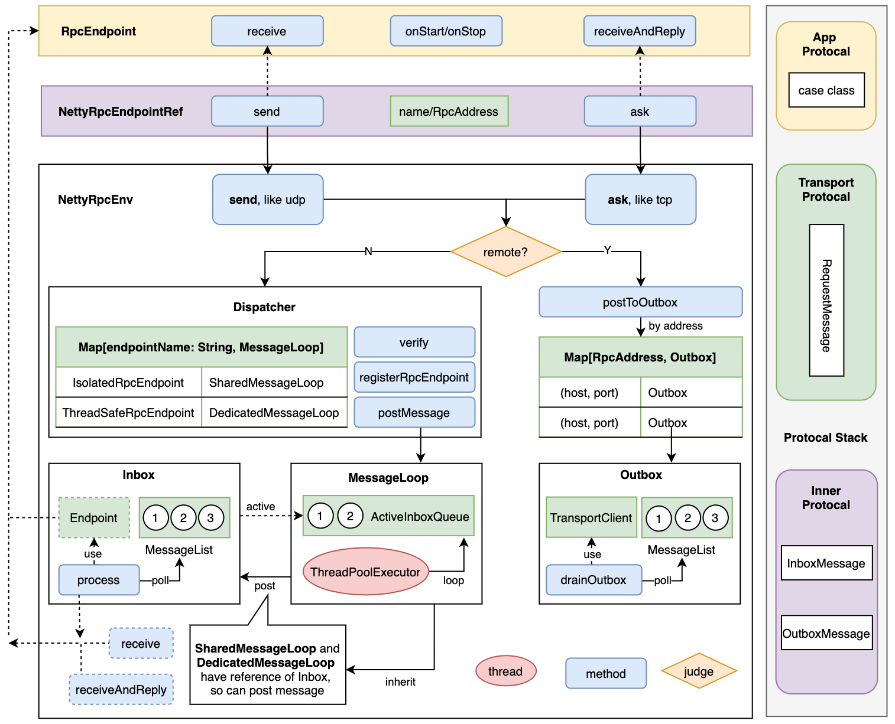

# Spark's RPC 
Spark drop akka actor from 2.x, and implement self rpc module(basic on Netty). But it copy some concept from Akka Actor.
## Framework of RPC



## RPC VS Akka Actor
I write some simple code to compare both of them. It's very similar. 
### Use RPC
```
// xyz.sourcecodestudy.rpc.example.HelloWorld.scala

case class Greet(whom: String, replyTo: RpcEndpointRef)
case class Greeted(whom: String, from: RpcEndpointRef)

class HelloWorld(override val rpcEnv: RpcEnv) extends RpcEndpoint with Logging {

  override def receive: PartialFunction[Any, Unit] = {
    case Greet(whom, replyTo) => {

      logger.info(s"Hello ${whom}!")

      replyTo.send(Greeted(whom, self))
    }
  }

}

class HelloWorldBot(override val rpcEnv: RpcEnv, max: Int) extends RpcEndpoint with Logging {

  private var replyTimes = 0

  override def receive: PartialFunction[Any, Unit] = {
    case Greeted(whom, from) => {

      replyTimes += 1
      logger.info(s"Greeting ${replyTimes} for ${whom}")

      if (replyTimes < max) {
        from.send(Greet(whom, self))
      } else {
        rpcEnv.shutdown()
      }
    }
  }
}

object HelloWorldMain {

  def apply(message: String): Unit = {
    
    val settings = new RpcSettings()
    val rpcEnv = RpcEnv.create("hello", "127.0.0.1", 9999, 1, settings)

    val greeter = rpcEnv.setupEndpoint("greeter", new HelloWorld(rpcEnv))
    val replyTo = rpcEnv.setupEndpoint("replyer", new HelloWorldBot(rpcEnv, max = 3))

    greeter.send( Greet(message, replyTo) )

    rpcEnv.awaitTermination()
  }

  def main(args: Array[String]): Unit = {

    val message = args.toSeq match {
      case head :: tail => head
      case Nil    => "World"
    }

    HelloWorldMain(message)
  }
}
```

### Use Actor
```
// xyz.sourcecodestudy.rpc.akka.HelloWorld

final case class Greet(whom: String, replyTo: ActorRef[Greeted])
final case class Greeted(whom: String, from: ActorRef[Greet])

object HelloWorld {

  def apply(): Behavior[Greet] = Behaviors.receive { (context, message) =>
    context.log.info("Hello {}!", message.whom)
    message.replyTo ! Greeted(message.whom, context.self)
    Behaviors.same
  }
}

object HelloWorldBot {

  def apply(max: Int): Behavior[Greeted] = {
    bot(0, max)
  }

  private def bot(greetingCounter: Int, max: Int): Behavior[Greeted] =
    Behaviors.receive { (context, message) =>
      val n = greetingCounter + 1
      context.log.info("Greeting {} for {}", n, message.whom)
      if (n == max) {
        Behaviors.stopped
      } else {
        message.from ! Greet(message.whom, context.self)
        bot(n, max)
      }
    }
}

object HelloWorldMain {

  def apply(message: String): Behavior[SpawnProtocol.Command] = {
    Behaviors.setup { context =>

      val greeter = context.spawn(HelloWorld(), "greeter")
      val replyTo = context.spawn(HelloWorldBot(max = 3), "replyer")

      greeter ! Greet(message, replyTo)

      SpawnProtocol()
    }
  }

  def main(args: Array[String]): Unit = {

    val message = args.toSeq match {
      case head :: tail => head
      case Nil    => "World"
    }

    // Init
    ActorSystem(HelloWorldMain(message), "hello")
  }
}

```